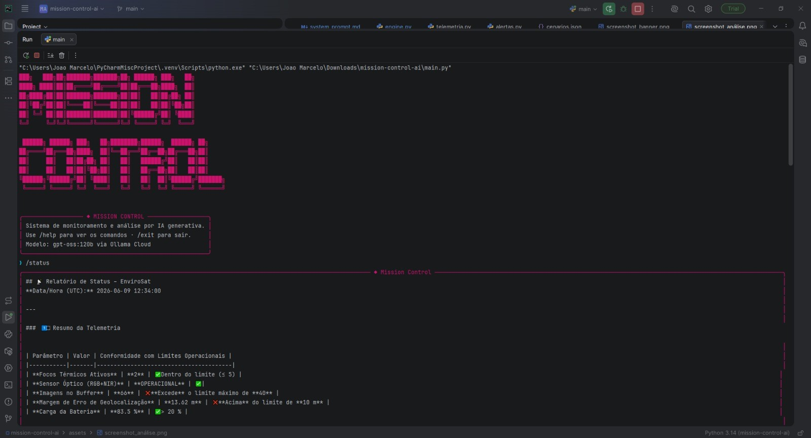
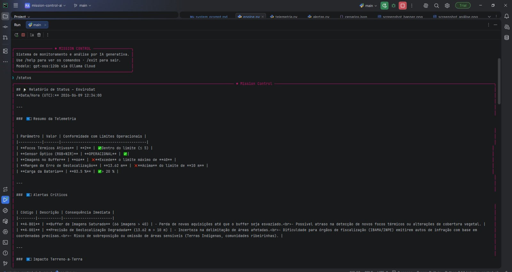

# 🌌 Mission Control AI — CLI Monitor

Este projeto consiste em um sistema de monitoramento e análise operacional baseado em Inteligência Artificial Generativa. Desenvolvido para atuar como uma interface de linha de comando (CLI) avançada, o **Mission Control** conecta-se a um modelo de linguagem de larga escala (LLM) local ou em nuvem para diagnosticar sistemas, responder a consultas operacionais e gerar relatórios de status em tempo real.

O projeto utiliza bibliotecas modernas de estilização de terminal (`rich`, `prompt_toolkit`, `pyfiglet`) para criar uma experiência rica, interativa e visualmente polida diretamente no console do operador.

---

## 👥 Informações do Grupo

* **João Marcelo de Melo e Silva** — RM: 572569
* **Pablo Renato dos Santos Sobral de Carvalho** — RM: 569894
* **Pedro Vianna** — RM: 570747

---

## 🎬 Demonstração em Vídeo

Assista à apresentação do projeto, explicação da arquitetura do código e demonstração prática do funcionamento do motor de IA no terminal através do link abaixo:

👉 **[Link do Vídeo no YouTube (
GS Mission Control IA - Prompt and Artificial Intelligence)](https://youtu.be/2lSSucg3u-o?si=_RDte6OHlfUqS4Hr)**

---

## 📸 Demonstração do Sistema (Prints Reais)

O terminal inteligente renderiza o banner em arte ASCII e processa telemetrias estruturadas em tempo real com o suporte do modelo analítico.

### Tela Inicial e Inicialização do Prompt
O sistema inicializa exibindo o banner estilizado via ASCII e o painel de metadados do modelo analítico, disponibilizando o prompt `❯` para o operador.



### Execução do Comando /status (Análise de Telemetria e Alertas Críticos)
[cite_start]Ao acionar o comando `/status`, a IA avalia o resumo da telemetria (imagens no buffer, precisão de geolocalização, bateria) e emite os alertas críticos e impactos imediatos em terra[cite: 55].


## 🧠 Treinamento, Refinamento e Comportamento da LLM

O processo de integração do modelo `gpt-oss:120b` passou por quatro ciclos de iteração, testes de estresse e engenharia de prompt para garantir respostas precisas, estruturadas e seguras para a operação do *Mission Control*.

### 🔄 Ciclo de Desenvolvimento do Motor de IA


✦ Ciclo 1: Ajuste de Estrutura ──> ✦ Ciclo 2: Lógica de Alertas ──> ✦ Ciclo 3: Teste de Estresse ──> ✦ Ciclo 4: Validação Final
  (System Prompt + Tokens)         (Correção de Gatilhos)           (Valores Absurdos & Bug)       (Prompt Otimizado)

Fase Inicial (Ajuste de Estrutura):
Nas primeiras interações, o modelo apresentava outputs desorganizados e desalinhados com a identidade visual do console. Foi necessário redefinir o System Prompt para impor restrições de formatação (Markdown e tabelas) e expandir o limite máximo de tokens (max_tokens), pois o modelo cortava as respostas antes de concluir a análise sintática dos dados.

Fase Intermediária (Lógica de Alertas e Consistência):
Com o layout corrigido, o comportamento da IA apresentou inconsistências na ativação automática de gatilhos de segurança (quando um alerta deveria ser considerado 'acionado' ou 'normal'). Após o refinamento das regras lógicas no prompt de sistema e um novo incremento na janela de tokens, a IA passou a categorizar os níveis de gravidade com maior precisão.

Fase de Estresse (Testes com Cenários Críticos e Debugging):
Foram injetados dados simulados com métricas absurdas e extremas (ex: temperaturas simuladas e falhas críticas simultâneas). A IA respondeu corretamente, priorizando a urgência e a criticidade dos impactos em terra. Durante essa fase, identificou-se o bug de dupla chamada da LLM no loop de execução do código ui.py, que causava redundância de requisições e processamento fantasma, corrigido com a limpeza do bloco condicional else.

Fase de Validação (Mitigação de Alucinações e Conclusão):
Ao simular cenários críticos extremos irreais, o modelo demonstrou uma taxa residual de alucinação (esperada devido à natureza dos parâmetros fictícios), que diminuiu drasticamente nos testes subsequentes. O motor provou-se altamente resiliente.

---

## 💼 Proposta de Valor / Modelo de Negócio 

A missão do **Mission Control AI**, acoplada à constelação do satélite *EnviSat*, resolve gargalos críticos na análise de dados geoespaciais ao traduzir telemetrias complexas em tomadas de decisões imediatas baseadas na Terra.

1. **Qual o problema realterrestre que esta missão resolve?**
   O sistema automatiza a detecção precoce de focos de incêndio florestal e degradação ambiental, mitigando o atraso na análise manual de imagens de satélite. Isso resolve diretamente a falta de resposta ágil no combate ao desmatamento ilegal e a queimadas descontroladas antes que se tornem catástrofes incontroláveis.

2. **Quem paga pela solução?**
   O modelo de financiamento é **híbrido**. Do lado do setor público, agências de fiscalização e monitoramento (como o INPE e IBAMA) financiam o núcleo de alertas para proteção ambiental. Do lado do setor privado, companhias de crédito de carbono e grandes cooperativas agroindustriais pagam pelo monitoramento de conformidade de terras.

3. **Métrica de impacto (Cenário de operação 100% saudável por 1 ano):**
   Com o monitoramento ininterrupto e alertas imediatos gerados pela inteligência analítica, estima-se o monitoramento preventivo de **15 milhões de hectares na região Amazônica e Cerrado**, resultando na mitigação rápida de incêndios e uma economia projetada de **1,2 milhão de toneladas de CO₂ evitadas** na atmosfera.

4. **Modelo de negócio:**
   A operação é estruturada sob o modelo de **DaaS (Data as a Service / Dado-como-serviço)** combinado com assinaturas corporativas. Governos acessam via concessão pública com níveis de serviço (SLA) rígidos, enquanto o setor privado consome APIs pagas por volume de requisições ou relatórios analíticos customizados por fazenda/região.

---

## 🛠️ Tecnologias e Dependências Utilizadas

O ecossistema do projeto é baseado em **Python 3.10+** e conta com os seguintes pacotes principais:

* [**prompt_toolkit**](https://python-prompt-toolkit.readthedocs.io/): Gerenciamento avançado de sessão de terminal, controle de prompts estruturados e histórico de inputs.
* [**rich**](https://rich.readthedocs.io/): Renderização visual elegante no console (painéis, tabelas de telemetria, status animados e limpeza de tela).
* [**pyfiglet**](https://github.com/pwaller/pyfiglet): Geração de títulos e banners em arte ASCII customizada (`ansi_shadow`).
* **Ollama (gpt-oss:120b)**: Motor de inferência local e em nuvem para orquestração da inteligência analítica e de diagnóstico.

---

## 🚀 Como Executar o Projeto

Para garantir o funcionamento correto de todos os recursos de interface (como cores em código hexadecimal e painéis dinâmicos), siga os passos descritos abaixo:

### 1. Clonar o Repositório e Instalar as Dependências
Abra seu terminal na pasta do projeto e configure o ambiente virtual (`.venv`):

```bash
# Crie e ative o ambiente virtual
python -m venv .venv

# No Windows (Prompt de Comando/PowerShell):
.venv\Scripts\activate

# Instale as dependências necessárias
pip install prompt-toolkit rich pyfiglet

